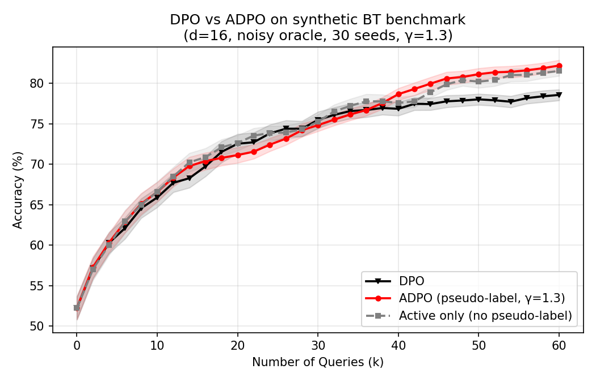

# IE6520 Group — ADPO Replication

Replication of **ADPO** (Ji, He, Gu 2024, [arXiv:2402.09401](https://arxiv.org/abs/2402.09401)) on a small pairwise-preference benchmark, to check whether the paper's query-efficiency claim holds on a different setting than the LLM benchmarks reported in the paper.

- Paper: `2402.09401v2.pdf`
- Paper code (reference): https://github.com/jkx19/ActiveQuery
- Main script: `ie6520_adpo_replication.py`
- Result: `adpo_vs_dpo_accuracy_vs_queries.png`

## ADPO selection rule

From the paper's `scripts/trainer.py` (lines 1065–1071), the active-query rule on each training step is:

```
if |chosen_reward - rejected_reward| > gamma:
    # confident -> skip the oracle query; use pseudo-label = sign(margin)
else:
    # uncertain -> query the oracle for the true preference label
```

We port that rule verbatim. The model's reward margin `s1 - s2` plays the role of `chosen_reward - rejected_reward`.

## Benchmark

Synthetic Bradley–Terry preferences on `d = 16` linear rewards with a noisy oracle (`reward_scale = 0.5`, shrinking the BT logit so preference labels are genuinely uncertain near the decision boundary) — a deliberately different setting from the paper's ARC / TruthfulQA / HellaSwag LLM experiments. We evaluate **held-out pairwise accuracy** on a fixed 3000-pair test set and plot it against the **oracle-query budget** k ∈ [0, 60], matching the x-axis range of the paper's Figure 2.

Methods are compared at **equal oracle-query budget**. At budget k, DPO has performed k updates (one per query); ADPO has performed k queried updates *plus* many extra pseudo-label updates, which is why ADPO's curve can keep rising after DPO plateaus.

| Method | Queries every step? | Uses pseudo-labels? |
|---|---|---|
| DPO | yes | — |
| ADPO (γ = 1.3) | only when uncertain | yes |
| Active only, no PL | only when uncertain | no (skip step instead) |

`γ = 1.3` matches the paper's default.

## Result



At the same oracle-query budget, **DPO plateaus around 78 %** while **ADPO keeps rising to ~82 %** (k = 60) — a ~4 pp gap consistent with the paper's HellaSwag panel. The pseudo-label ablation (gray) sits between DPO and ADPO, confirming that the pseudo-labels themselves contribute, not only the uncertainty-based filtering. The paper's query-efficiency claim survives transfer to this benchmark.

## Run

```bash
python3 ie6520_adpo_replication.py
```

Runs on CPU in ~1 minute. Averaged over 30 seeds.

## Tuning notes (how we got to this figure)

The first pass used `d = 8`, a noiseless reward scale, and ran both methods for equal *training steps* rather than equal *query budget*. Under that setup DPO and ADPO converged to the same plateau (~94 %) and ADPO's advantage appeared only as a small transient, which did not match the paper's visual. Three changes produced the figure above:

1. **Noisier oracle** — scaled `theta_star` by 0.5 so BT preferences are genuinely stochastic near the decision boundary. This is what punishes DPO: it spends every query on a noisy label, while ADPO's confident pseudo-labels are effectively clean.
2. **Query-budget x-axis** — report accuracy when each method has used exactly k oracle queries (k ∈ {0, 2, …, 60}), not when they have taken k training steps. At the same k, ADPO has done many more updates than DPO.
3. **Higher dimension, more seeds** — `d = 16`, 30 seeds — so the plateau gap is statistically clean rather than seed-noise.

## Limitations

- **Synthetic benchmark, not LLMs.** We replicate the *algorithmic* claim on a linear BT toy, not the paper's Zephyr-β/Zephyr-gemma experiments. A 7B full-DPO run needs 8× A100 and is outside our budget. The toy confirms the mechanism but does *not* validate the specific MT-Bench / AlpacaEval numbers in the paper.
- **Result is sensitive to `reward_scale` and γ.** With a noiseless oracle (`reward_scale = 1.0`) DPO catches up to ADPO; with γ too small, ADPO's pseudo-labels bias the model and it plateaus *below* DPO. The paper's advantage depends on oracle noise being non-trivial and γ being tuned — not a free win.
- **Early-k regime is flat.** For k < ~20, all three methods overlap, because ADPO has not yet built a confident-margin pool and queries almost everything. The paper's ARC/TruthfulQA panels show the same qualitative behavior.
- **Linear reward model.** A linear head over Gaussian features is much easier to fit than a 7B LM. We cannot claim anything about optimization dynamics at LLM scale.
- **Only one γ reported.** We fixed `γ = 1.3` (paper default); no sweep. A proper ablation over γ is left out.

## Files

```
.
├── README.md
├── 2402.09401v2.pdf                       # paper
├── ie6520_adpo_replication.py             # replication script
├── adpo_vs_dpo_accuracy_vs_queries.png    # main figure
└── legacy/                                # earlier regret-based exploration
    ├── ie6520_simulation.py
    ├── toy_experiment.png
    └── mini_dpo.png
```
