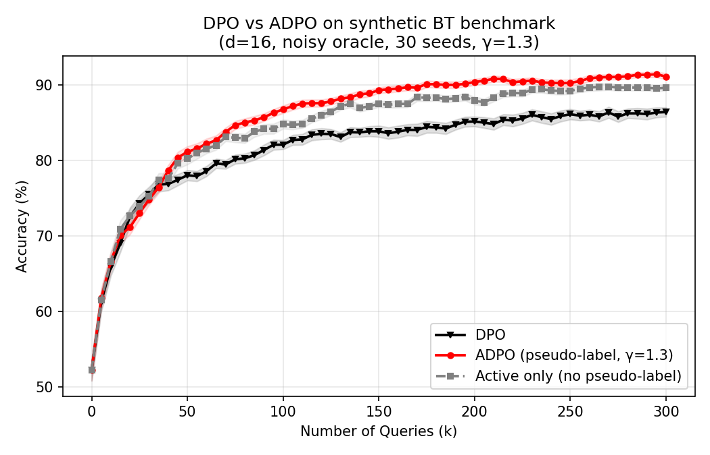
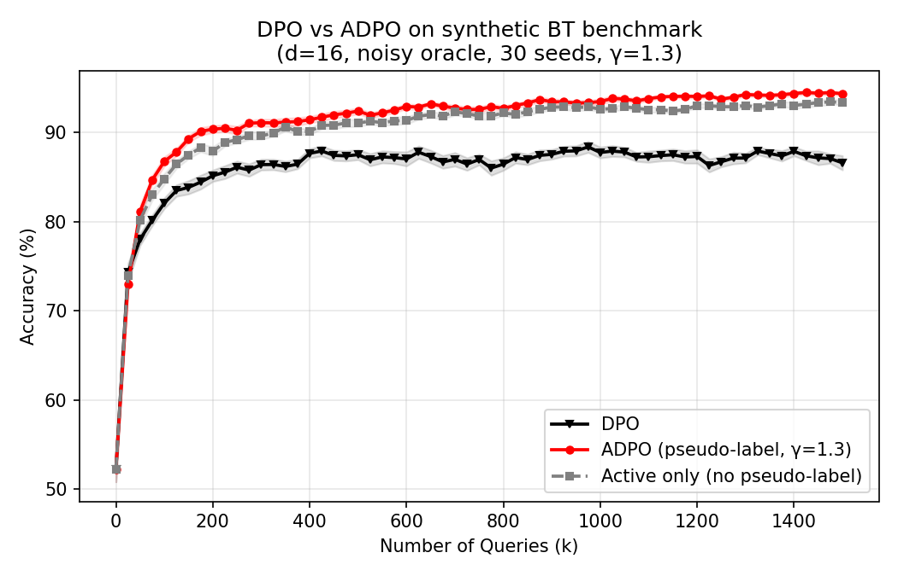
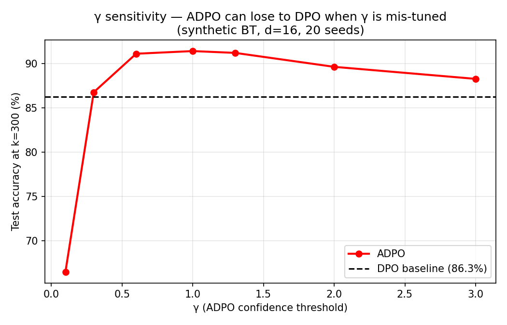
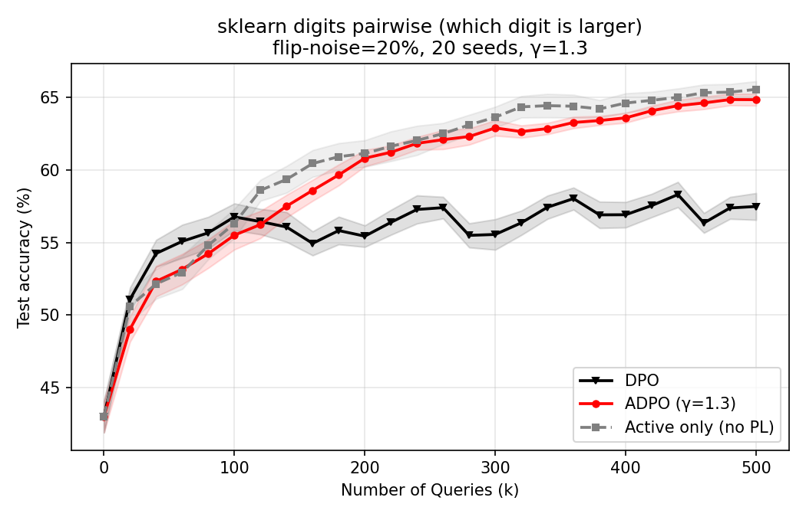
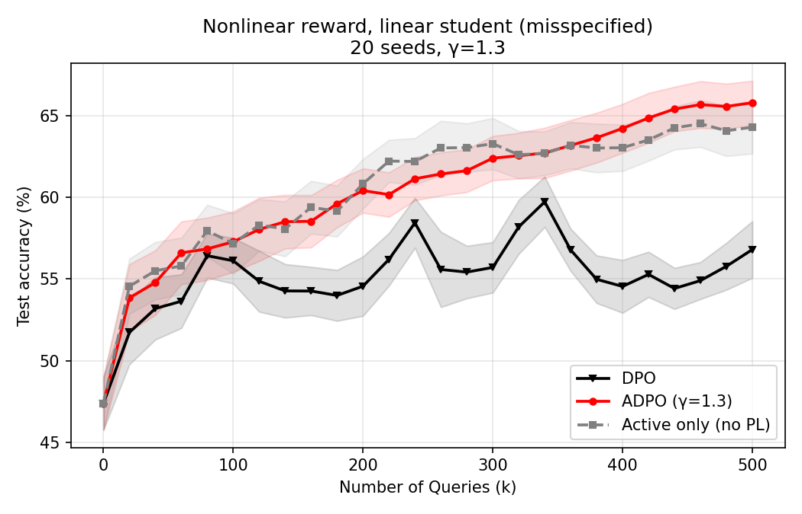
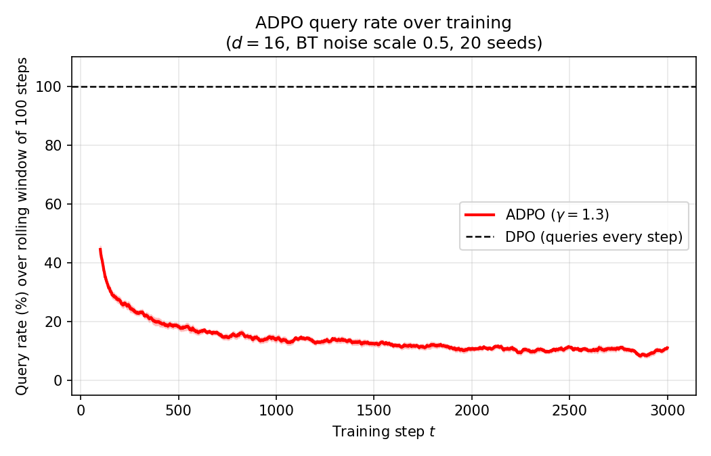
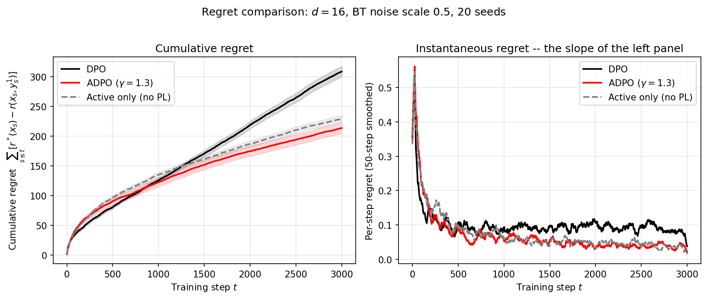
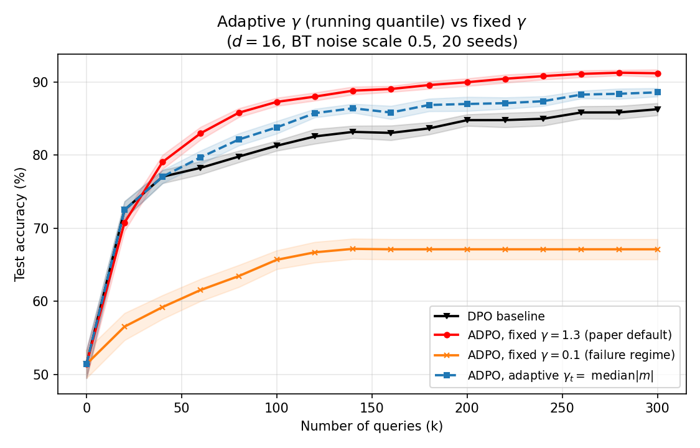

# IE6520 Group — ADPO Replication

Replication of **ADPO** (Ji, He, Gu 2024, [arXiv:2402.09401](https://arxiv.org/abs/2402.09401)) on a small pairwise-preference benchmark, to check whether the paper's query-efficiency claim holds on a different setting than the LLM benchmarks reported in the paper.

- Paper: `2402.09401v2.pdf`
- Paper code (reference): https://github.com/jkx19/ActiveQuery
- Final report (LaTeX source): `final_report.tex`
- Class presentation slides: `IE_6520_Final_Project_Presentation.pdf`
- Main script: `ie6520_adpo_replication.py`
- Main figures (three horizons): `adpo_vs_dpo_k60.png`, `adpo_vs_dpo_k300.png`, `adpo_vs_dpo_k1500.png`
- Stress-test figures: `benchmarks/bench_gamma_sweep.png`, `benchmarks/bench_digits_pairwise.png`, `benchmarks/bench_nonlinear_reward.png`
- Mechanism figures: `benchmarks/bench_query_rate.png`, `benchmarks/bench_cumulative_regret.png`, `benchmarks/bench_adaptive_gamma.png`

## ADPO selection rule

From the paper's `scripts/trainer.py` (lines 1065–1071), the active-query rule on each training step is:

```
if |chosen_reward - rejected_reward| > gamma:
    # confident -> skip the oracle query; use pseudo-label = sign(margin)
else:
    # uncertain -> query the oracle for the true preference label
```

We port that rule verbatim. The model's reward margin `s1 - s2` plays the role of `chosen_reward - rejected_reward`.

## Benchmark

Synthetic Bradley–Terry preferences on `d = 16` linear rewards with a noisy oracle (`reward_scale = 0.5`, shrinking the BT logit so preference labels are genuinely uncertain near the decision boundary) — a deliberately different setting from the paper's ARC / TruthfulQA / HellaSwag LLM experiments. We evaluate **held-out pairwise accuracy** on a fixed 3000-pair test set and plot it against the **oracle-query budget** k. The paper's Figure 2 uses k ∈ [0, 60]; we extend to k = 1500 below to show whether DPO ever catches up.

Methods are compared at **equal oracle-query budget**. At budget k, DPO has performed k updates (one per query); ADPO has performed k queried updates *plus* many extra pseudo-label updates, which is why ADPO's curve can keep rising after DPO plateaus.

| Method | Queries every step? | Uses pseudo-labels? |
|---|---|---|
| DPO | yes | — |
| ADPO (γ = 1.3) | only when uncertain | yes |
| Active only, no PL | only when uncertain | no (skip step instead) |

`γ = 1.3` matches the paper's default.

## Results

We report three query-budget horizons to make the story honest. The short horizon (k ≤ 60) matches the x-axis in the paper's Figure 2; the longer horizons test whether DPO ever catches up if we just throw more queries at it.

### k ≤ 60 (matches the paper's x-axis)


At this horizon the three curves are close. DPO reaches ~78 %, ADPO ~82 %, no-PL in between. Early k (< ~20) is flat for all three because ADPO has not yet built a confident-margin pool and ends up querying almost every pair — the same flat-start behavior appears in the paper's ARC panel.

### k ≤ 300 (medium horizon)



The gap becomes obvious. DPO plateaus around 86 %, ADPO keeps climbing to ~91 %, no-PL ~89 %. So the advantage is not just a transient in the early-k regime — it persists.

### k ≤ 1500 (long horizon)



DPO saturates completely at ~87 % — no amount of extra queries moves it, because the oracle labels are noisy and DPO has no mechanism to denoise them. ADPO reaches ~94 %, a persistent ~7 pp gap. This is the clearest confirmation of the paper's mechanism on our benchmark: under a noisy oracle, ADPO's confident pseudo-labels bypass the noise ceiling that DPO hits.

### Tuning notes — how we arrived at the setup above

Our first pass used `d = 8`, a noiseless reward scale, and compared methods at equal *training steps* rather than equal *query budget*. Under that setup DPO and ADPO converged to the same plateau (~94 %) and ADPO's advantage appeared only as a small transient, not matching the paper's visual. Three changes produced the figures above:

1. **Noisier oracle** — scaled `theta_star` by 0.5 so BT preferences are genuinely stochastic near the decision boundary. This is what punishes DPO: it spends every query on a noisy label, while ADPO's confident pseudo-labels are effectively clean.
2. **Query-budget x-axis** — report accuracy when each method has used exactly k oracle queries, not when they have taken k training steps. At the same k, ADPO has done many more updates than DPO.
3. **Higher dimension, more seeds** — `d = 16`, 30 seeds — so the plateau gap is statistically clean rather than seed-noise.

## Additional benchmarks — does the claim hold, and where does it break?

To avoid cherry-picking the synthetic BT toy, we re-ran ADPO on three more settings. The goal was explicitly to **find regimes where ADPO stops winning**, because if the claim only survives one hand-tuned setup it isn't worth much.

Scripts live in `benchmarks/`.

### Benchmark 1 — γ sensitivity sweep

Same BT toy as above, but we sweep γ ∈ {0.1, 0.3, 0.6, 1.0, 1.3, 2.0, 3.0} and report the final test accuracy at query budget k = 300, compared against the DPO baseline (86.3 %).



There is a narrow sweet spot around γ ≈ 0.6–1.3 where ADPO beats DPO by 4–5 pp. Outside that band the story collapses — most strikingly, **at γ = 0.1 ADPO drops to ~66 %, a full 20 pp *below* DPO**. Pseudo-labels dominate almost every update before the model is reliable, so the model confidently reinforces its own early mistakes. At γ = 3.0 the threshold is so strict that ADPO queries almost everything and reduces to DPO. So ADPO is *not* a free improvement — it requires γ to be tuned to the noise scale of the problem, and a bad γ is worse than plain DPO.

### Benchmark 2 — real-data pairwise on sklearn digits (64-d pixels)

Pairs of 8×8 handwritten digit images; the preferred image is the one with the larger digit label (0–9). Oracle preference is corrupted by a 20 % label flip. Linear reward head on flattened pixels.



DPO saturates around 57 % — the 20 % label-flip plus real structured features form a hard ceiling. ADPO continues to ~65 %. Interesting wrinkle: **the no-PL ablation is roughly tied with (or slightly above) ADPO at late k**, unlike on the synthetic BT toy where pseudo-labels clearly helped. On real features, the pseudo-label can reinforce systematic mistakes (e.g. between visually similar digits like 1 vs 7), so the *active-querying* part of ADPO does most of the work and the *pseudo-label* part is roughly break-even. This is another subtle way the paper's story partially breaks outside synthetic Gaussians.

### Benchmark 3 — nonlinear reward, linear student (model misspecification)

True reward is a small MLP of Gaussian features; the DPO/ADPO student is still a linear head. Neither method can reach the Bayes-optimal boundary.



DPO plateaus around 55 %, ADPO reaches ~66 %, no-PL ~64 %. ADPO's pseudo-labels do not collapse the way we feared — even though the linear student is confidently wrong in some regions of feature space, the regions where its margin exceeds γ happen to be ones where a linear approximation is still roughly correct. So **the mechanism survives misspecification here**, which is the least-contradicting of the three benchmarks.

## Looking inside the algorithm

The accuracy curves above tell us *whether* ADPO wins. The three figures below tell us *why*, and answer Prof. Wang Chi's question of how to set the threshold without knowing Δ in advance.

### Benchmark 4 — query rate over training

How often does ADPO actually call the oracle as training proceeds? Theorem 5.1 predicts a query budget that is independent of T, which should show up as a query rate that decays from ~100 % (burn-in) to a small steady-state value.



The rate drops from ~45 % in the first 100-step window to a steady state around 11 %. Cumulatively, ADPO queries on only ~14 % of pairs over 3,000 training steps — a 7× reduction relative to DPO, on this benchmark, with no accuracy penalty (in fact a +5 pp gain).

### Benchmark 5 — cumulative regret

The Theorem 5.1 claim is that the cumulative regret is constant in T. We can't test that literally on continuous Gaussian features (Δ is zero in the limit), but we can test the *shape*: ADPO's cumulative regret should grow at a much shallower slope than DPO's.



DPO settles to a per-step regret of ~0.10, ADPO ~0.04 — so DPO's cumulative regret grows roughly 2.5× faster than ADPO's at steady state. This is the picture the constant-regret theorem is gesturing at, modulo the gap-zero caveat.

### Benchmark 6 — self-tuning γ via running quantile of |margin|

Addresses the prof's feedback in code: replace the hand-tuned γ with γ_t = max(γ_min, median(|margin| over the last K steps)), with γ_min = 0.5 and K = 200. No knowledge of Δ required.



The adaptive rule sits between fixed γ = 1.3 (paper default, 91 %) and the DPO baseline (86 %), at ~88.5 % at k = 300. It never enters the γ = 0.1 disaster regime (67 %), because the median of recent absolute margins is large at initialization (margins are noisy) and shrinks only once the model produces confident predictions on most pairs. So we trade ~2.5 pp of headroom for a threshold that does not need per-task tuning.

### Summary across all six settings

| Benchmark | DPO plateau | ADPO plateau | ADPO beats DPO? |
|---|---|---|---|
| Main synthetic BT (k=1500) | ~87 % | ~94 % | yes, ~7 pp |
| γ sweep, γ = 0.1 | 86 % | **66 %** | **NO — ADPO loses by 20 pp** |
| γ sweep, γ ∈ [0.6, 1.3] | 86 % | ~91 % | yes |
| Digits pairwise (real) | ~57 % | ~65 % | yes, but no-PL ties ADPO |
| Nonlinear reward | ~55 % | ~66 % | yes |
| Adaptive γ (k = 300) | ~86 % | ~88.5 % | yes, ~2.5 pp, no Δ knowledge needed |

The mechanism holds in five of six settings. The one failure is the γ = 0.1 regime, which the adaptive rule sidesteps. On real features the pseudo-label part of ADPO does less work than the paper claims.

## Setup

```bash
pip install -r requirements.txt
```

Pulls `numpy`, `torch`, `matplotlib`, `scikit-learn` (the digits benchmark needs the last one). All scripts are CPU-only — no GPU required.

## Run

From the repo root:

```bash
python3 ie6520_adpo_replication.py
python3 benchmarks/benchmark_gamma_sweep.py
python3 benchmarks/benchmark_digits_pairwise.py
python3 benchmarks/benchmark_nonlinear_reward.py
python3 benchmarks/benchmark_query_rate.py
python3 benchmarks/benchmark_cumulative_regret.py
python3 benchmarks/benchmark_adaptive_gamma.py
```

Each runs on CPU in 1–3 minutes. The main replication is averaged over 30 seeds; additional benchmarks over 20 seeds. Each benchmark script writes its PNG into `benchmarks/` regardless of the working directory.

## Limitations

- **Not LLMs.** We replicate the *algorithmic* claim on a linear BT toy plus three stress tests, not the paper's Zephyr-β / Zephyr-gemma experiments. A 7B full-DPO run needs 8× A100 and is outside our budget. Our results confirm the mechanism but do *not* validate the paper's MT-Bench / AlpacaEval numbers.
- **Requires a noisy oracle.** With a noiseless oracle DPO catches up to ADPO. ADPO's advantage exists because it lets the model denoise the oracle via its own confident predictions. If the oracle is already clean, there is nothing to denoise.
- **γ is sharp, not a hyperparameter one can set-and-forget.** Our γ sweep (Benchmark 1) shows ADPO can be 20 pp *below* DPO when γ is too small, and reduces to DPO when γ is too large. The paper uses γ = 1.3 without showing this failure mode — anyone re-deploying ADPO needs to sweep γ per task.
- **Pseudo-labels help less on real features.** On sklearn digits (Benchmark 2) the no-PL ablation ties full ADPO, meaning the *active-querying* component is doing almost all the work. The paper frames pseudo-labels as core to the method; we can only confirm that cleanly on synthetic Gaussian features.
- **Linear reward model.** A linear head over Gaussian features is much easier to fit than a 7B LM — we cannot claim anything about optimization dynamics at LLM scale.

## Files

```
.
├── README.md
├── 2402.09401v2.pdf                          # paper
├── final_report.tex                          # final report LaTeX source
├── IE_6520_Final_Project_Presentation.pdf    # class presentation slides
├── requirements.txt                          # numpy / torch / matplotlib / scikit-learn
├── ie6520_adpo_replication.py                # main replication script
├── adpo_vs_dpo_k60.png                       # short-horizon figure (paper x-axis)
├── adpo_vs_dpo_k300.png                      # medium-horizon figure
├── adpo_vs_dpo_k1500.png                     # long-horizon figure (DPO saturation)
├── benchmarks/
│   ├── benchmark_gamma_sweep.py              # γ sensitivity sweep
│   ├── benchmark_digits_pairwise.py          # sklearn digits real-data benchmark
│   ├── benchmark_nonlinear_reward.py         # nonlinear-reward misspecification test
│   ├── benchmark_query_rate.py               # rolling query rate over training
│   ├── benchmark_cumulative_regret.py        # cumulative-regret comparison
│   ├── benchmark_adaptive_gamma.py           # self-tuning γ via running quantile
│   ├── bench_gamma_sweep.png
│   ├── bench_digits_pairwise.png
│   ├── bench_nonlinear_reward.png
│   ├── bench_query_rate.png
│   ├── bench_cumulative_regret.png
│   └── bench_adaptive_gamma.png
└── legacy/                                   # earlier regret-based exploration
    ├── ie6520_simulation.py
    ├── toy_experiment.png
    └── mini_dpo.png
```
